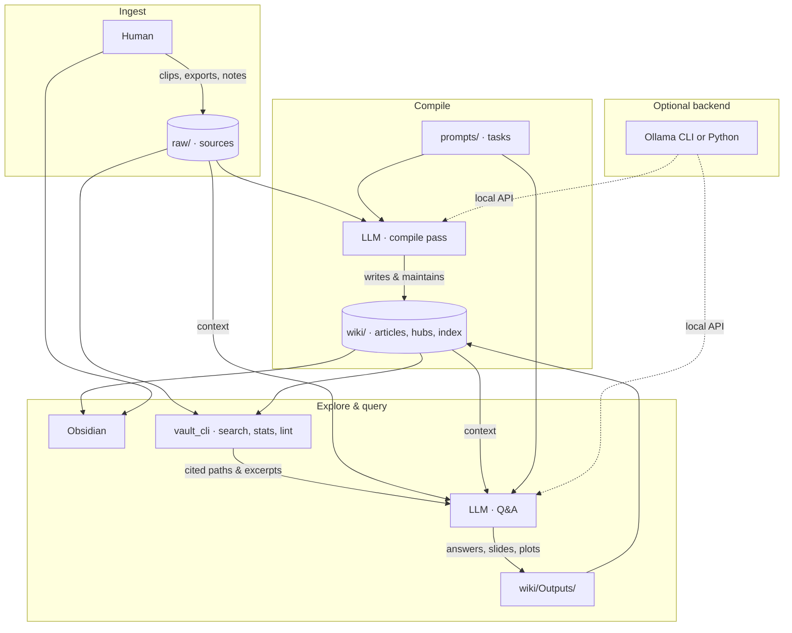

# LLM knowledge vault (POC)

**Repository:** [github.com/Paul-UK/llm-knowledge-vault](https://github.com/Paul-UK/llm-knowledge-vault)

A **personal research vault** where you keep sources under `raw/` and let an LLM maintain a linked **wiki** (`wiki/*.md`) for summaries, concepts, and answers. The human edits `raw/` (clips, exports, notes); the model updates `wiki/`, indices, and outputs. [Obsidian](https://obsidian.md/) is a good viewer for both trees.

This repo is a **minimal scaffold**: folder contract, a stdlib-only vault CLI, optional **[Ollama](https://ollama.com/) Python client** (`pip install -r requirements-ollama.txt`), and copy-paste prompts under `prompts/`.

### Overview diagram



Same graph lives in [`diagrams/vault-overview.mmd`](diagrams/vault-overview.mmd) for editors, [Mermaid Live](https://mermaid.live/), or Marp. If you change one copy, update the other so they stay aligned.

---

## How it fits together

1. **Ingest** — You add material to `raw/` (Obsidian Web Clipper, PDF sidecars, dataset readme snippets, copied repo notes, screenshots described in markdown, etc.).
2. **Compile** — The LLM reads new or changed `raw/` files and updates `wiki/`: source stubs, concept pages, `wiki/meta/source-index.md`, and optionally `wiki/meta/manifest.json`.
3. **Navigate** — You browse in Obsidian; the hub note is `wiki/_index.md`.
4. **Q&A** — You or the agent run `search` to find candidates, read markdown, then answer. Durable answers can be written under `wiki/Outputs/qa/`.
5. **Hygiene** — Run `lint` after edits so broken `[[wikilinks]]` surface quickly.

There is **no embedding/RAG service** in this POC: at modest size, search plus a large context window plus good index pages is enough. You can add FTS or embeddings later without changing the folder layout.

---

## Directory layout

| Path | Purpose |
|------|---------|
| `raw/` | **Your** inputs. Treat as provenance; avoid silent deletes. |
| `wiki/` | **LLM-maintained** articles, hubs, links. |
| `wiki/_index.md` | Main hub (domains, pointers to meta pages). |
| `wiki/meta/source-index.md` | Table (or list) of every `raw/` file with a short summary and link to a wiki source stub. |
| `wiki/meta/manifest.json` | Optional compile log (`entries` array: which sources were compiled, which wiki paths changed). |
| `wiki/Sources/` | One note per source, linking back to a path under `raw/`. |
| `wiki/Concepts/` | Topic articles; backlink to `Sources/` and other concepts. |
| `wiki/Outputs/` | Generated Q&A, slides (e.g. Marp), exports. Subfolders by type are fine. |
| `wiki/assets/plots/` | Default place for matplotlib (or other) figures referenced from wiki notes. |
| `tools/vault_cli.py` | `stats`, `search`, `lint` — no third-party dependencies. |
| `tools/ollama_run.py` | Optional: chat via official [`ollama` PyPI](https://pypi.org/project/ollama/) package (local HTTP API). |
| `requirements-ollama.txt` | Optional dependency pin for `ollama_run.py`. |
| `prompts/` | Starter system/user instructions for compile and Q&A passes. |
| `AGENTS.md` | Short rules you can give an agent so it respects the same contract. |
| `diagrams/vault-overview.mmd` | Mermaid source for the overview chart (also embedded above). |

---

## Requirements

- **Python 3** — `vault_cli.py` uses the stdlib only.
- **Obsidian** (optional but recommended): open **this repo folder** as the vault so `raw/` and `wiki/` stay visible side by side.
- **Ollama** (optional): [install](https://ollama.com/download) the app or CLI so the local API is available. For Python calls, also run `pip install -r requirements-ollama.txt` (or add `ollama` to your environment). You can still use shell `ollama run` or any other stack without that package.

---

## CLI reference

Run commands from the **repository root** (`llm-knowledge-vault`).

```bash
# File counts and rough word totals for wiki/ and raw/
python3 tools/vault_cli.py stats

# Case-insInsensitive substring search over .md files (prints path:line:excerpt)
python3 tools/vault_cli.py search "your terms"
python3 tools/vault_cli.py search "your terms" --scope wiki
python3 tools/vault_cli.py search "your terms" --scope raw
python3 tools/vault_cli.py search "your terms" --max-hits 50

# List broken [[wikilinks]] under wiki/ (exit 1 if any)
python3 tools/vault_cli.py lint
```

### How `lint` resolves wikilinks

For each `[[...]]`, the tool strips display text (`|`) and anchors (`#`). `http` targets are ignored.

- If the link **contains `/`**, only **`wiki/<link>.md`** is checked (e.g. `[[Concepts/foo]]` → `wiki/Concepts/foo.md`).
- Otherwise it tries **`wiki/<link>.md`**, then **`wiki/Concepts/<link>.md`**.

Name files accordingly (Obsidian usually aligns wikilinks with note filenames).

---

## Working with Ollama

1. Drop new content under `raw/` (mirror your real folder structure however you like).
2. Run a **compile** pass: use **`prompts/ollama-compile-pass.md`** as the instruction block and a concrete user message (paths or “what’s new in `raw/`”). Paste the model’s proposed edits into files, or use an agent that can edit the repo.
3. Run **`python3 tools/vault_cli.py lint`** and fix any reported links.
4. For **Q&A**, use **`prompts/ollama-qa.md`**, run **`search`** first with keywords from the question, then read the listed files.

### Shell (`ollama run`)

Example (model name is yours):

```bash
cd /path/to/llm-knowledge-vault
ollama run llama3.2 "$(cat prompts/ollama-compile-pass.md)

User: Compile raw/samples/example-clip.md into the wiki; update source-index and manifests."
```

### Python (official `ollama` library)

The [Ollama Python library](https://github.com/ollama/ollama-python) uses the same local HTTP API as the CLI (`ollama serve` or the desktop app). It was **not** required for the original POC; it is **optional** and listed in `requirements-ollama.txt`.

```bash
cd /path/to/llm-knowledge-vault
python3 -m venv .venv && source .venv/bin/activate   # optional
pip install -r requirements-ollama.txt
```

```bash
# Full prompt file → system message; -u = user turn
python3 tools/ollama_run.py -m llama3.2 \
  -p prompts/ollama-compile-pass.md \
  -u "Compile raw/samples/example-clip.md; follow AGENTS.md."

python3 tools/ollama_run.py --stream -p prompts/ollama-qa.md -u "Your question ..."
```

**`OLLAMA_MODEL`** sets the default model when `-m` is omitted (otherwise `llama3.2`). **`OLLAMA_HOST`** points the client at a remote Ollama instance if needed (see upstream docs).

---

## Design notes

- **Raw vs wiki** keeps provenance obvious and lets you re-run compilation if prompts or models change.
- **Source index + hubs** reduce the need to grep the whole tree blindly; encourage the LLM to keep them current.
- **Outputs under `wiki/Outputs/`** make answers first-class content you can link from concept pages later.

For machine-readable instructions aimed at the model, see **`AGENTS.md`**.
